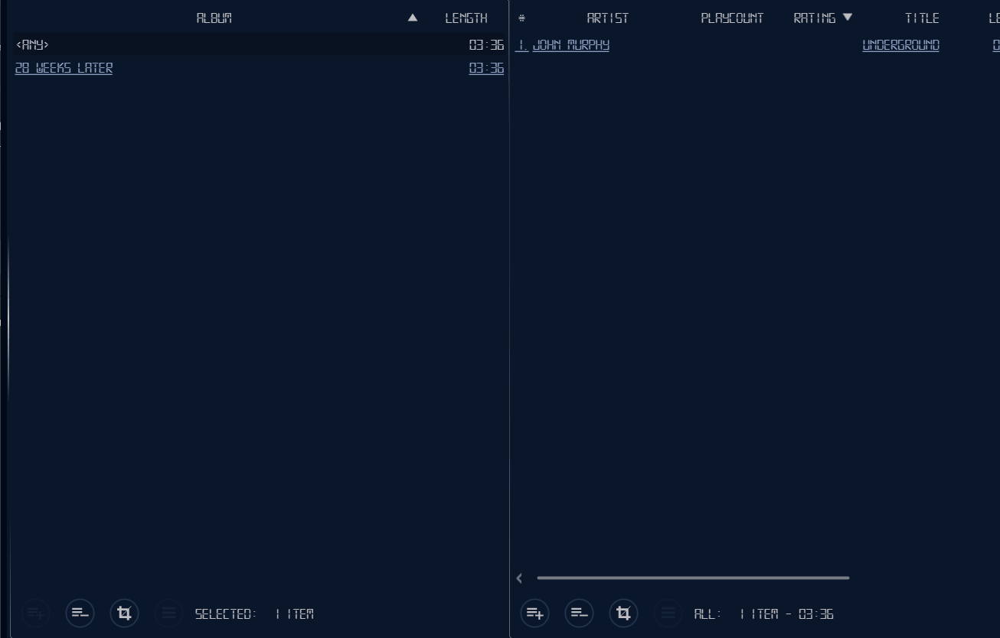

#  Spit Player  

- [What is this?](#what-is-this)
- [Download -> Build -> Run](#use)
- [Do I need this?](#do-i-need-this)
- [Features](#features)
- [Screenshots](#screenshots)
- [Copyright](#copyright)
- [Contributing](CONTRIBUTING.md)

## What is this?

**Spit Player** is a desktop audio player and management application, with a modular ui/functionality capable of compiling and reloading its own parts. Uses VLC under hood.

**Is this ready?** Yes. I do not provide downloads, but you can easily build the application. See [how](#use). Well tested on Windows. Linux/OSX supported.

**Can look like this:**

**Can do this:**

## Do I need this?

You decide. This application has been born out of frustration with how applications today look and are used.
There are two main major use cases for this application:

##### Audio playback & management system
Ever lost your entire library or song ratings due to corrupted database file?
Ever wanted to have song chapters or other cool features?
Ever needed multiple playlists or display/manipulate your songs in a way that wasn't possible for some reason?

This application addresses a lot of such issues.
However, it may lack features you may be used from other media players, so it may not be for you.

##### Multi-application
Ever wanted to do things your way?

Parts of the applications are called widgets and may run as standalone applications and be developed or changed while the application runs.
This application provides several useful widgets, but most importantly the necessary tools for you to create your own.

If you know Java/Kotlin, you can make your own app with a simple text editor and literally few lines of code.
Just write your code, hit save and watch as it auto-compiles and runs as widget, which you can run as a standalone application with just an application run argument! 
All that with included support for configurations, skins and full access to the internals.
See [how](CONTRIBUTING.md#widgets).

## Use

Download link coming in the future.
For build manually from the latest sources:

1. [Download & prepare project](CONTRIBUTING.md#preparations)
2. Build the application
    1. `./gradlew build` builds the application
    1. `./gradlew jar` creates jar & copies dependencies to `/lib`
    1. Standalone application is now build in [app](/app) directory
3. Deploy application
    1. `./gradlew linkJdk`to link [app/java](/app/java) to JDK
    1. copy [app](/app) directory to whenever you want
        - to be fully portable, turn the link [app/java](/app/java) into a directory (remove link, copy target directory with same name) 
4. [Run application](CONTRIBUTING.md#running-application)

## Features

### Guiding Principles

- **Customizability** - User uses the application how he wants, not how it was designed to be used. 
    Therefore emphasis on customization, skins, settings, etc.
- **Portability** - No installation (or need for java or other programs), run from anywhere, little/no trace, 
    everything is packaged along. Any OS.
- **Modular functionality** - User can launch or use only selected components he is interested in and 
    ignore everything else as if it was never there.
- **Modular user interface** - User has the ability to 'make his own gui'. Completely custom component layout. 
    He can create all-in-one GUI or use separate windows or - anything really.
- **Fancy features** like: rating in tag, time comments, good image support, advanced & intuitive library management, etc.
- **Library independence** - Moving & renaming files will not result in loss of any information. Every single bit is in the tag. 
    Always. If you move on to different application or lose your library - you never lose data. Ever again.
- **Usability** - Ease of use and efficient workflow due to minimalistic and unobtrusive graphical user interface design. 
    Think shortcuts, swiping, icons, intuitive use, etc.
- **Responsive** - fast and responsive. Minimal modal dialogs. No modal or blocked windows while your library is scanning 
    that big fat audio collection
- **Sexy** - Your way of sexy if you know a tiny bit about css.

### Play audio 

- anything Vlc player can play

### Manage audio

Song database:
- small footprint: in 10s of MBs for 10000s audio files
- big: 40000 files no problem
- fast: library is loaded into main memory (RAM).
- no dependency: song files always store all data in their tag, moving or renaming files poses no problem.
- no inconsistencies: displayed song metadata can only be out of sync with real data if the tag is edited 
  by an external application (or as a result of a bug)
- no data loss guarantee: losing database has no effect at all, it can be completely rebuilt anytime. 
  The library serves as a persistent cache, not as data storage.

Management system is only as good as its user interface. There are powerful tables that try to be as flexible as possible.
Tables:
- big: 30000 songs in playlist no problem (although good luck loading it at the app start...)
- smart columns: set visibility, width, sorting (multiple column), order of any column for any song attribute
- visual searching: by any (textual) attribute (artist, composer, title, etc) simply by writing. 
	Scrolls 1st match (to center) and highlights matches - so they 'pop' visually - which doesn't strain your eyes that much. 
	Its fast (no CTRL+F, just type...) and convenient.
- powerful filtering - CTRL+F. Shows only matches. Filtering here is basically constructing logical predicates (e.g.: 'year' 'less than' '2004') and 
	it is possible to use **any** combination of attributes (columns), 'comparators' and permissible values. Filters can be inverted (negation) or chained (conjunction).
- group by - e.g. table of groups of songs per attribute (e.g. year or artist) Searching, filtering and sorting fully supported of course.
- multiple column sorting by any attribute (artist, year, rating, bitrate, etc)
- cascading - link tables to other tables as filters and display only selected songs (e.g. show songs of autor A's  albums X,D,E in year Y in three linked tables reacting on table selection). Basically library widgets allow linking selection of the table as an input, while simultaneously providing its selection as an output to other tables. Use however library widgets (each having 1 table) you wish and link them up in any way you want.

### Tag audio

Spit Player supports reading & writing of song tags

- individually
- by group
  - using Tagger to write the same data to multiple tags (songs may share an artist)
  - using Converter to write multiple data to multiple tags (e.g. using titles from a tracklist)

Supported are:
- all file types (see at the top), including wma and mp4 (which normally can not have a tag)
- all fields (comprehensive list later), including rating, playcount, color, timed comments.

The aim is to be interoperable with other players, where possible. Noteworthy or nonstandard supported tags include:
##### Rating
- values are in percent values independent of implementation (mp3=0-255, flac/ogg=0-100)
- floating values (0-1). Values like {1,2,3,4,5} are obsolete, illogical and nobody agrees on what they mean. Use full granularity (limited only by tag (1/255 for mp3, 1/100 for other formats)) and pick graphical representation (progress bar or any number of "stars" you want). Basically rate 1) how you want 2) all audio types the same 3) be happy the value is in the tag 4) visualie the rating value as you want - be it 3 stars or 10 or a progress bar.
- interoperable with other players (POPM frame), but most of them will only recognize the value in their own way
##### Playcount
- number of times the song has been played (the exact definition is left upon the user, who can set up the playcount incrementation behavior arbitrarily, or edit the value manually (increment/decrement/set arbitrary number - its your collection, excert your power!).
- the data are written in custom tag (in mp3, written duplicitly in POPM frame counter)
##### Time comments/chapters
- comments associated with specific time/part of the song. They can be added during playback on the seeker and viewed in popup menus.
- the GUI makes it really easy to add or edit these and takes no space, since uses the seekbar and popup windows.
- the data are written in custom tag
##### Color
- just in case you want to associate songs with a colors, you can.
- using custom tag
##### Cover
- image in tag can be imported/exported, but I advise against placing images in audio tags, 
  	consumes space and is semantically incorrect (cover is album metadata, not song metadata).
- cover read from file location is supported too, looking for image files named:
  - song title.filetype
  - song album.filetype
  - cover.filetype or folder.filetype
  
### Configurability

All settings and entire user interface layout serialize into a human-readable and editable files. 
These can be edited, backed up or switched between applications.

### Modularity

Most of the functionalities are implemented as widgets, that can be loaded, closed, moved and configured separately. 
Multiple instances of the same widget can run at once in windows, layouts or popups. 

Widgets' source files can be created and edited in runtime and any changes will be immediately reflected in the application. 
This means that if you are a developer you can simply edit code of the .java file, hit save and watch as 
the widgets are (recompiled and then) reloaded with previous state and configuration. 
  
#### Widgets

##### Playback
Controls for playback, like seeking. Supports song chapters.
##### Playlist
Table or playing songs. Of course, it is possible to use more of them once. Very handy to have a side-playlist sometimes.
##### FileInfo
Shows cover and song metadata. Supports cover download (url drag & drop) and rating.
##### Tagger
Tag editor
##### Converter
Object-object converting facility.
  - Displays objects as text while allowing user to apply function transformations. Handy file renamer and per-song 
    group tagger. Supports object lists, text transformations, manual text editing, regex, writing to file etc.
  - Provides set of functions that transform java objects (such as String or File). User can then set some kind of input 
    (formally List<INPUT>) and apply and chain these transformation functions (on every element of the list) to get some 
    result (List<OUTPUT>. It may sound confusing at first, but its a intuitive and very powerful thing, particularly when 
    combined with the ability to see the transformation output as a text at every step and the ability to manually edit 
    that text and reuse it as an input for further transformation. The final output can be used as text or for an action, 
    such as
    - file renaming
    - tagging

This makes it possible to import song titles from copy-pasted tracklist found on web by 'cleaning' it up with text line 
transformations (remove x characters from start, etc.) rather than manually. Changing extension or names of a bunch of 
files is a peace of cake.
##### Library & LibraryView
Song tables. User can link them up so they display increasingly filtered/sepecialized content. For example, 1st table can display all artists (all unique artists in entire song library), 2nd table linked to 1st would display all unique albums of songs by any artist/s selected in the 1st table. So on until Nth table displays the songs. Combinations are endless. In addition, because of the modular gui, you can set up table size and position as you wish and the layout is not restricted to area of the window (layout has own virtual space, like virtual desktops). Lastly, in is possible to set up widgets (in this case individual tables) to be 'passive' until user allows them to load properly - it is possible to create a multiple views with lots of tables with practically no performance impact at all (by using views only when needed and have them 'sleep', but be prepared and configured all the time).
##### Image
Image viewer - displays an image
##### ImageViewer
Displays images and thumbnails for images in a directory
  - Can also be set up to display directory of the currently playing song (or any song for that matter). 
  	Useful to show more than a song cover, if you have more album images.
  - has slideshow mode
  - has a 'theater mode' intended to use as fullscreen album cover slideshow with a 'now playing' info overlay
##### Settings
Configuring facility displaying settings for either:
  - application
  - widget
  - JavaFX scenegraph
  - other java object implementing Configurable. There are methods to turn plain java objects into Configurable. 
  	For example using annotations on fields or using JavaFX properties.
##### Inspector
Displays hierarchies:
  - application modules
  - file system
  - scene graph (this is taking the idea from the ScenicView app and works basically the same). When used with the combination of Settings widget its a great way to debug the application scenegraph (yeah from within the application)
##### Logger
Displays System.out in a TextArea, meant for developers
##### IconBox
Configurable icon bar/dock. User can add/remove custom icons executing some predefined.
##### FunctionViewer
Plots custom mathematical function in a graph

### Portability

The application in its self-contained form:
- is executable on its own
- requires no installation or preinstalled software
- runs from anywhere
- does not require internet access
- does not write to registry or create files outside its directory apart from temporary files

### GUI

The Interface is minimalistic but powerful and fully modular. 
Modules (widgets) are part of layout hierarchy, which can be manipulated, saved or even loaded as standalone application. 

- minimalistic - shows only whats important, no endless headers and borders taking up important space. With headerless and borderless window mode 100% of the space is given to the widgets.
- powerful - infinite virtual space, horizontally scrollable, zoomable
- layout mode - temporary 2nd ui layer allowing user to edit and configure the layout, widgets and more, alleviating normal user interface from all this
- completely skinnable (css)(skin discovery + change + refresh does not require application restart)

##### Widgets
- can provide input and output (e.g. playlist table has selected song as output)
- inputs and outputs can be bound - when output value changes, it is passed into the listening input of other widget
- inputs can be set to custom values
- the whole system is displayed visually as editable graph
- can load lazily - be passive until user explicitly requests loading with mouse click.

##### Layouts
- widget management: Gui gives the ability to divide layouts into containers for widgets. These allow resizing, positioning, swapping, adding, removing and many more widget operations.
- Individual containers form nested hierarchy that can be configured at any level easily through user interface, navigating with left (down) + right (up) mouse click in layout mode. 
- multiple layout support/virtual layout space. Switching layouts by dragging them horizontally (left,right) opens new space for more layouts. This provides virtually infinitely large and conveniently navigable working space.

##### Windows
- snap to screen edges and other windows, screen-to-screen edges also supported.
- auto-resize when put into screen edges and corners (altogether 7 different modes - all, left/right half, right half, topleft/topright/bottomleft/bottomright quadrant)
- system tray, taskbar, fullscreen, always on top
- mini mode - a docked bar snapped to the top edge of the screen
- multiple screen support
- multiple windows
- configurable notification positions (corners, center) + window/screen oriented

### Hotkeys

- global hotkey supported - shortcuts dont need application focus if so desired
- media keys supported
- customizable (any combination of keys:  "F5", "CTRL+L", etc)
- large number of actions (playback control, layout, etc)

### Usability
- navigation: No more back and up buttons. Use left and right mouse buttons to quickly and seamlessly navigate within user interface.
- icons: No ugly buttons doing the unexpected. Icons are designed to visually aid user to understand the action. 
	Decorated with tooltips. Some are also skinnable or change to visualize application state.
- tooltips: Everywhere. And big too. Explain all kinds of functionalities, so read to your heart's content. 
	There are also info buttons opening information popups.
- units: No more '5000 of what questions', everything that needs a unit has a unit, e.g. filesize (kB,MB,...), time duration, bitrate, etc. 
	Multiple units are supported when possible, e.g., using 2000ms or 2s has the same effect. 
	This is all supported in application settings or in table filter queries.  
- validation: Designed to eliminate input errors by preventing user to input incorrect data. 
	Warning icons signal incorrect input. Really helps with writing regular exressions.
- defaults: Every settings has a default value you can revert to easily.
- shortcuts: Quick & easy control over the application anytime.
- smart ui: Notifications that can be closed when they get in the way or keep being open when mouse hovers over. 
	Throw notifications manually or put whole widgets in it. Tables or docked window that monitor user activity. 
	Clickless ui reacting on mouse hover rather than click.

### More

- Configurable playcount incrementing strategy: at specified minimal time or percent of song playback
- Web search with a query, e.g. search album on Google (opens default browser)
- Cover downloading on drag&drop
- Cool animations & effects
- Smart and intuitive drag&drop system
  - area that can be dropped on is visually highlighted and displays icon 
  	and description of the action that would be executed
  - individual components supporting drag&drop can cover each other
- Crisp images in any size. Images load quickly and don't cause any lag (not even the big ones), 
	images around 5000px are handled just fine, apart from the inevitable memory footprint.

## Screenshots

  
Show

#### Playlist view & timed comments

#### Action menu with "glass" effect

#### Layout mode with widget links

#### Some widgets on white skin

#### Comet Game

### Old skins

# Copyright

##### player module (`sp.it.pl`)

This is the application module, containing the source code for the functionality.
For now, the sources are provided with **no licence**.   
Which does not mean anything is permitted, it is the opposite. This may change in the future.

##### widget modules

This is a collection of source codes for widgets for this application, found in [app/widgets](/app/widgets).
For portability reasons, each widget specifies its licence. Usually it is [The Unlicense](http://unlicense.org). 

##### util module (`sp.it.util`)

This is collection of useful utility methods/extension, with primary intention of supporting the player module of this project.

All the sources, unless specifically stated otherwise in the source code file, are under [The Unlicense](http://unlicense.org).

##### demo module (`sp.it.demo`)

This is a collection of demonstrative projects found on the internet, mostly contributed as answers on stackoverflow.com.
The sources are provided with **no licence**.   
Which does not mean anything is permitted, it is the opposite. This is because it would be too time-consuming to find the
authors/contributors and figure things out. If you need to use the code, the files contain information about where to find the authors of the code.
