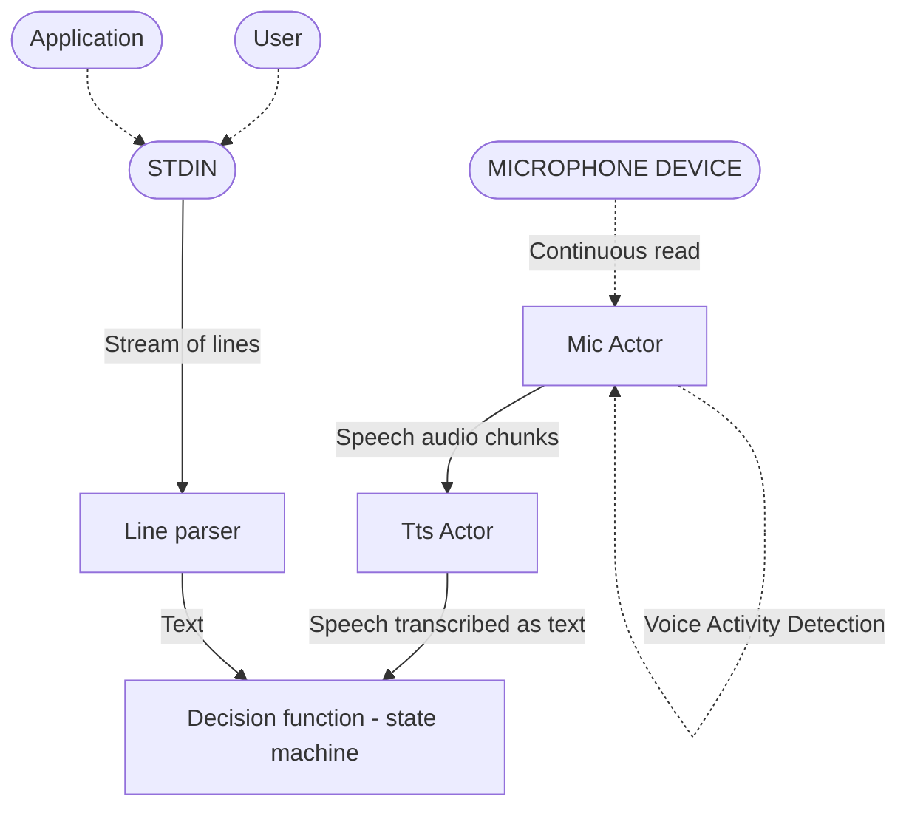
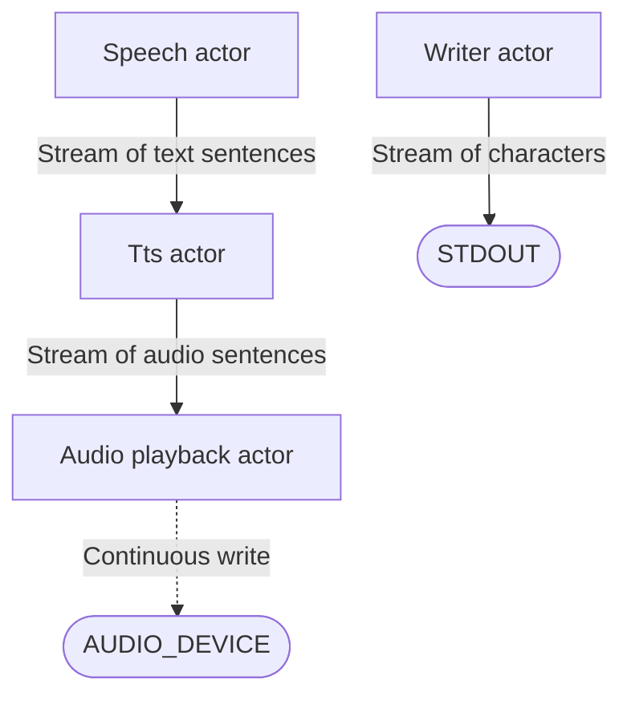
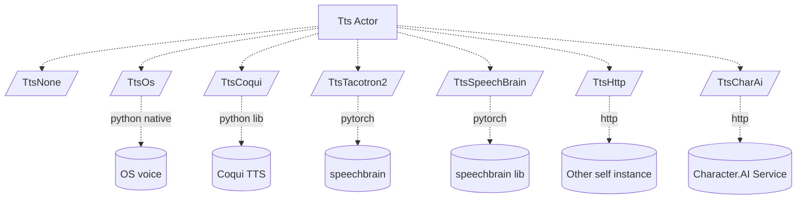
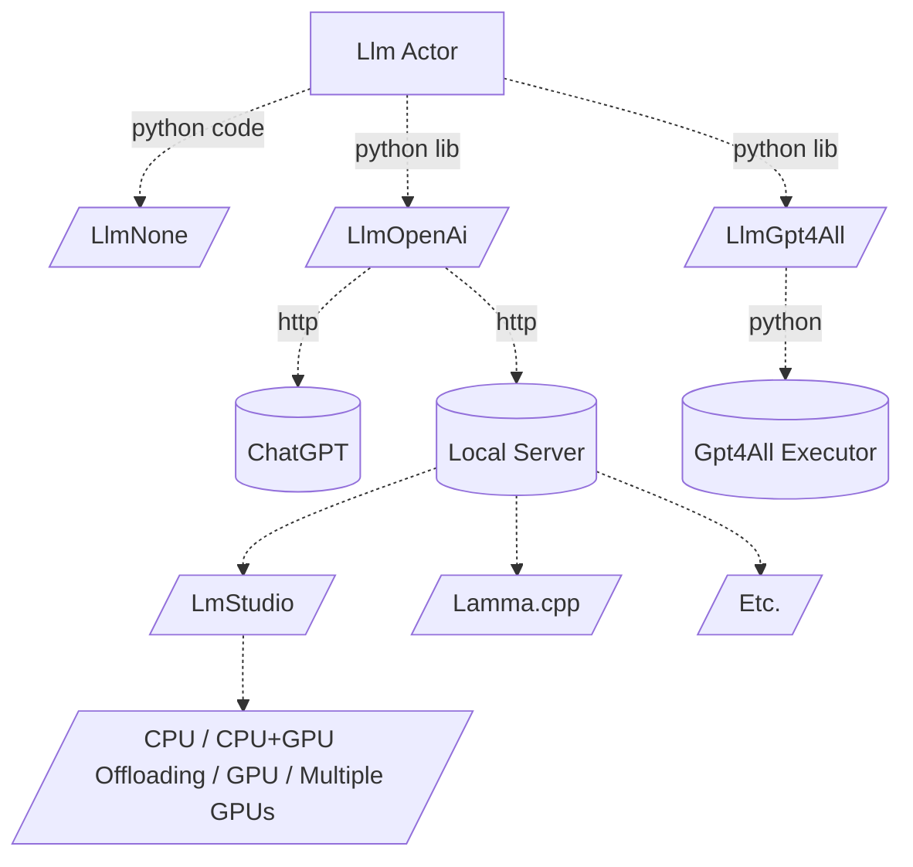

## Introduction
This is a voice assistant python program. Features:
- speech recognition
    - configurable tts engine (local offline)
    - configurable wake word
    - transcribes user speech
    - automatic microphone recovery
- speech feedback
    - configurable speech engine (possibly using offline)
- conversation with LLM
    - configurable llm engine (possibly using local OpenAI-compatible offline server)
- 3rd-party application integration
   - controllable through stdin through CLI or launched by external application
   - parsable output for convenient integration for 3rd-party applications
   - terminates automatically when parent terminates
- optimized for real-time use (instant chat/voice feedback)

## Architecture


###### Input


###### Output


###### Logic


###### Tts



###### LLM


###### Http
```mermaid
flowchart LR
  HTTP[Http API]
  HTTP -->|endpoint| HTTP1[path: speech \n returns generated audio \n requires Tts==TtsCoqui]
  HTTP -->|endpoint| HTTP2[path: actor \n returns all actor states for monitoring]
  HTTP -->|endpoint| HTTP3[path: intent \n returns result of intent detection \n requires Llm!=LlmNone
```

## Features

###### Voice control
User can speak to the assistant by speaking its name (configurable, `System` by default)
```
USR: System
SYS: yes
```
```
USR: System, command
SYS: doing command...
```

###### Assistant name
User can change assistant name to any text value.
However, the name should be easy for the system to recognize.
Further, name implying the function of the assistant may improve recognition of the following content, such as commands.
Hence, `System` turns out to be really good name, while custom names such as `Jarvis` less so.

###### Delayed voice control
User can avoid speaking assistant name during short period after the name was already spoken.
```
USR: System
SYS: Yes
USE: command without repeating system name
```

###### Voice chat
Use can speak without calling the assistant's name completely in `CHAT` mode.
In this mode user is conversing with LLM, which requires LlmActor enabled and running.
```
USR: System start covnersation
SYS: Conversing...
USR: Tell a joke
...
```

###### Voice dynamic responses
If LlmActor is enabled, user will try to avoid common hardcoded responses and
instead use Lllm to generate dynamic ones based on the (customizable) system prompt.
This can give the assistant more personality.

###### Voice commands
User may speak commands for assistent to execute.
These are matched against command's matcher (see features below).
```
USR: System my command
```
User may speak multiple commands at once, using `and` word.
```
USR: System my command and other command
```

###### Custom/Programmatic commands
Voice commands can be registered/unregistered programmatically at any time.
```kotlin
// create command
val handler = SpeakHandler("Name of the command", "command speech matcher") { text ->
   if (matches(text)) { doX(); Ok("Ok") }
   else null
}
// subscribe command
val unregister = Disposer()
val assistant = APP.plugins.plugin<VoiceAssistant>()
assistant.syncWhile { it.handlers addRem handler } on unregister  // subscribes handler while assistant is on and until custom disposer
unregister() // unsubscribe
```

###### Command matching
Command can be matched with arbitrary logic. There is built-in regex-like matcher that can be used.
This syntax supports:
- optional word using `word?`
- alternative word using `word1|word2|word3`
- parameters using `$param` (use `_` as delimiter)
Example of a matcher: `open|show widget? $widget_name widget?`
See `SpeakHandler` class.
```kotlin
SpeakHandler(name = "Log off OS", matcher = "log off system|pc|computer|os") {
   if (matches(text)) {
     logOff()
     Ok()
   } else
     null
}
```

###### Command feedback
Upon matching command, it returns `Try<String?, String?>?`, meaning success/error/no match with optional speech feedback.
This can be arbitrary complex, for example matching command but refusing match because of invalid parameter value:
```kotlin
SpeakHandler(name = "Say hello", matcher = "say hello"
) {
  if (matches(text))
    if (feelLikIt()) Ok("Hello")
    else Error("No thank you")
  else
    null // no match
}
```

###### Asynchronous commands
The commands are Kotlin suspending functions and as such implicitly support asynchronous execution.
Inside the handler, it is possible to launch Kotlin coroutines, wait for jobs or futures, delay, and so on.

###### Command parameters
It is up to the command logic to extract the parameters from the command, but the built in
matcher is transformed into regex and can be used to extract the values using `Regex` API.
TO make this easier, there is `args(text)` method, that does this, and with destructuring support
```kotlin
SpeakHandler(...) {
   if (matches(text)) {
      // using regex API
      val args = regex.matchEntire(text)!!.groupValues  // regex implicitly available, matching guaranteed to pass here
      // manually
      val arg1 = text.substringAfter("command-prefix") // arbitrary logic
      // auto
      val (arg1, arg2) = args(text) // destructures to tuple of any size!
      
      if (validateMyInput(arg1)==false) return null // return no match for bad parameter
     ...
   } else
     null
}
```

###### Command intent detection
Sometimes the parameter value should be more flexible than simply used as spoken by user.
User may not remember exact parameter values or even exact command. 
If no command matches, and LLM Actor is running, the command is passed to LLM for intent-detection.

In this phase, LLM takes a prompt with available commands and user speech and creates command by itself.
If LLM assumes no command matches what user intended, it returns no-op command.
The prompt with available commands needs not be structured and may have smart hints for the LLM,
such as comment explaining the command parameters or giving range of possible values).
```
Available functions:
- open-widget-$widget_name  // available widgets: weather, playlist, ...
- ignored // when no command is probable
```

This way, saying `whats the weather like` may produce actual command `open-widget-weather-info`.
This makes voice control much more flexible.
This is automatic and requires no code or setup other than `Llm` actor enabled and good model
(`mistral instruct v0.2 7B` or `Nous Hermes 2 Mistral DPO 7B` do a great job)

###### Command parameter intent detection
Sometimes the command or parameter is dynamic or the command hint for the LLM is too long or troublesome.
Command may, after successful match, even after intent detection, use LLM to detect correct parameter value.
For this `SpeakContext.intent` function may be used, which invokes customized intent detection.
One may wish to simply pass the result of the `intent` function back into itself, which is possible and prevents infinite loop automatically.
```kotlin
fun SpeakContext.openWidget(text: String): ComMatch =
   if (matches(text)) {
      val widgetName = ...
      if (f!=null) openWidget(widgetName)
      // widget found
      if (f!=null) Ok("Ok")
      // widget not found and we already tried custom intent (propagated automatically with `SpeakContext` as `this.intent`)  
      else if (!intent) Error("No widget $fNameRaw available.")
      // widget not found, try custom intent that calls self
      else intent(text, "${availableWidgets()}\n- unidentified // no recognized function", fNameRaw) { this("open widget $it") }
   } else {
      if (!intent) Error("No such widget available.")
      else null
   }
SpeakHandler("Open widget by name", "open|show widget? \$widget-name widget?") { openWidget(it) }
```

###### Command confirmation
Sometimes a command should require a confirmation or ask user for additional arguments before being invoked.
For this, command may put itself into a confirmation queue using `SpeakContext.confirming` function,
which invokes the actual behavior with the additional user voice feedback.
The confirmation queue is `first-in-last-out` and (last) command is cleared on first user voice response, regardless of matching result.
The confirmation request and confirmation matcher are both flexible.
Example of such command:
```kotlin
SpeakHandler(name = "Log off OS", matcher = "log off system|pc|computer|os") {
   if (matches(text)) confirming("Do you really wish to turn off pc?", "yes|indeed|roger") { turnOffPc() }
   else null
}
```

###### Command chaining
The `SpeakContext.confirming` and `SpeakContext.intent` functions can be mixed and nested to do hierarchical command matching.
This allows reducing the size of command hint prompt to LLM and reducing chance
that LLM will confuse multiple similar commands by using multiple guided inferences instead of one complicated one.
Developer has power to guide the matching process freely and provide dynamic context to guide LLM.

If these multiple inferences should be part of user interaction, use `confirming`, if they need be hidden, use `intnt()`.
```kotlin
SpeakHandler(name = "Configure", matcher = "configure system") {
   if (matches(text))
     confirming("Which settings?", "\$setting") { setting ->
       if (isUnknownSettng(setting) 
         Error("Unknown setting $setting")
       else confirming("What value? Possible values are: ${listSettings()}", "\$value}") { value ->
         if (isUnknownValue(setting) Error("Unknown setting value $value")
         else changeSetting(setting, value)
       }
     }
   else
    null
}
```

###### General intent detection
The `SpeakContext.intent` uses `\intent` http API of the underlying python process.
The `\intent` http API is not limited and can be used by any application and in any way.
It is simply a service to intelligently convert input into output.

## Installation

1. Install python >= `3.11`
2. Install python dependencies
    ```
    pip install SpeechRecognition
    pip install playsound
    pip install sounddevice
    pip install soundfile
    pip install PyAudio
    pip install pysilero-vad
    pip install psutil
    pip install pyperclip
    pip install pyautogui
    pip install pygetwindow
    ```
3. Install desired tts module:
    1. **TtsOs** requires https://github.com/Akul-AI/rlvoice-1
        - `pip install rlvoice-1`
        - on Linux also needs `sudo apt update && sudo apt install espeak ffmpeg libespeak1`
        - on OsX also needs `pip install pyobjc==9.0.1`
    2. **TtsCoqui** requires https://pypi.org/project/TTS/
        - `pip install TTS`
        - Download XTTSv2 model
           - the following files into [models-coqui](models-coqui) directory
               - `config.json`
               - `hash.md5`
               - `model.pth`
               - `vocab.json`
           - agree to the terms and conditions in [models-coqui](models-coqui) directory by
               - creating `tos_agreed.txt` file with content `I have read, understood and agreed to the Terms and Conditions.`
    3. **TtsTacotron2**
        - TODO
    3. **TtsSpeecBrain** 
        - TODO
4. Install desired stt module:
    1. **SttWhisper** requires https://github.com/openai/whisper
        - `pip install openai-whisper`
        - model will be downloaded automatically, but you can do so manually
            - Download OpenAi Whisper [models](https://github.com/openai/whisper#available-models-and-languages) (optional)
            - into the [models-whisper](models-whisper) directory
            - from [official source](https://github.com/openai/whisper/blob/f296bcd3fac41525f1c5ab467062776f8e13e4d0/whisper/__init__.py)
    2. **SttNemo**
        - TODO
5. Install desired llm module:
    1. **LlmOpenAi**
    2. **LlmGpt4All**
        - `pip install gpt4all` 
        - Download LLM model for [GPT4All](https://gpt4all.io/index.html) (optional)
            - model is required only for conversation feature 
                - into the [models-llm](models-llm) directory
                - for example from [official source](https://gpt4all.io/models/models.json)

## Running

```python main.py```

For help invoke `-h` or `--help`

#### Recommended setup
First run the raw script with no arguments.
Setup microphone sensitivity settings and speech recognition model (`base.en` should be absolutely enough.
Or skip audio setup and control program though CLI `SAY`/`CHAT` commands.
Then try couple of commands.
For speech generation try offline `speech-engine=coqui`.
For llm chat try `llm-engine=openai` with [LmStudio](https://lmstudio.ai) and run it simply as server (everything should work out of the box).

#### Performance
Weak systems:
It should be possible to run Whisper (and os voice) and be able to do voice commands.

Good system:
Whisper small + Coqui + 8B (Q4) LLM model (CPU mode) work flawlessly on Nvidia 4070 + AMD 5800X3D.

##### Multitasking
Since voice generation is running simultaneously with chat LLM generation (and potentially whisper as well),
the requirements on hw (particularly gpu) may scale up fast. Experiment and see what works for you.
It may be better to run LLM purely on CPU to free GPU for text-to-speech and speech-to-text. 

#### Idle
To reduce GPU/CPU load, simply do not use any functionality.
It is possible to disable microphone and avoid speech-recognition.
It is currently not possible to unload any models from memory.

### Online/Offline
The goal of this project is to be offline and independent, but it is possible to use online llm and voice generation,
reducing hw requirements substantially.

## Integration

### Wake word
Can be configured with a script argument.
Experiment and pick word that you like, but is also easy to detect.

### Output format
This script prints:
- system log in format`SYS: $message`
- recognized user speech in format `RAW: $speech`
- recognized user speech, sanitized, in format `USER: $speech`
- recognized user command, in format `COM: $command`

All multiline content has newlines replaced by `\u2028`, an unicode newline character.
This allows `\n` newlines to define individual output boundaries, instead of defining custom special char/sequence.
Java does not recognize `\u2028` as newline, which can also be leveraged.

Output is streamed token by token. Consumer may want to read by token instead of lines.

### Input format (optional)
- `SAY-LINE: text` and speaks it (if `speech-engine` is not `none`)
- `SAY: $base64_encoded_text` and speaks it (if `speech-engine` is not `none`)
- `CHAT: $base64_encoded_text` and send it to chat (if `llm-engine` is not `none`)

Text for `SAY` and `CHAT` must be base64 encoded so it can contain multiline and special characters.
Base64 is more portable solution and guaranteed to solve all special character issues.
Currently, input is always consumed whole (no streaming).

### S2T (speech to text)

Currently, `OpenAI Whisper` or `Nvidia Nemo Parakeet` is supported. Model can be specified.

### T2S (text to speech)
By default, system voice is used.

#### none
No voice.

#### os
Uses built-in OS text-to-speech (offline, high performance, low quality).

#### coqui
Uses xttsv2 model (offline, low performance, realistic quality).
```
pip install torch
pip install TTS
```

#### character.ai
Supports [character.ai](https://beta.character.ai) voice generation (requires free account and access token)
using [PyCharacterAi](https://pypi.org/project/PyCharacterAI/), read details there.
```
pip install PyCharacterAI
```

### LLM (Chat)
By default, disabled. GPT4All supported models can be provided to enable LLM chat functionality.

### Termination
This script terminates:
- upon `CTRL+C`
- when parent process terminates, if launched with `parent-process=$pid` argument
- when receives `EXIT` on input stream

## Hardware requirements
Depends on the configuration.

## Copyright
See [LICENCE](LICENCE)

## Acknowledgment
Loosely based on **AI-Austin**'s [GPT4ALL-Voice-Assistant](https://github.com/Ai-Austin/GPT4ALL-Voice-Assistant)