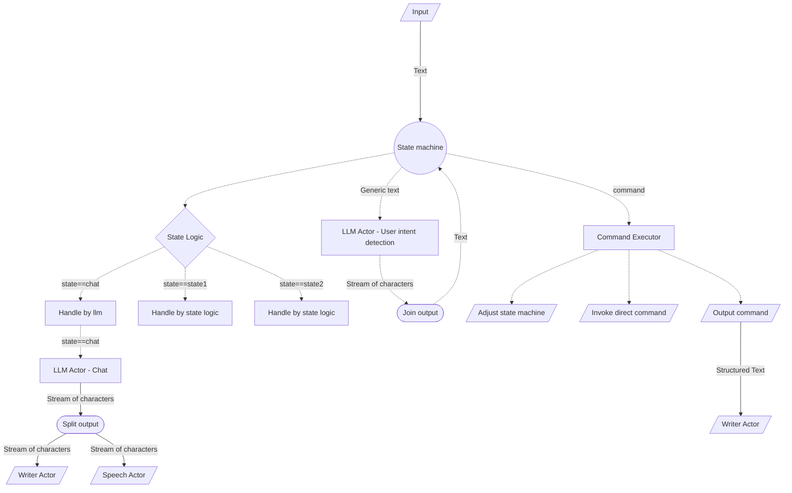
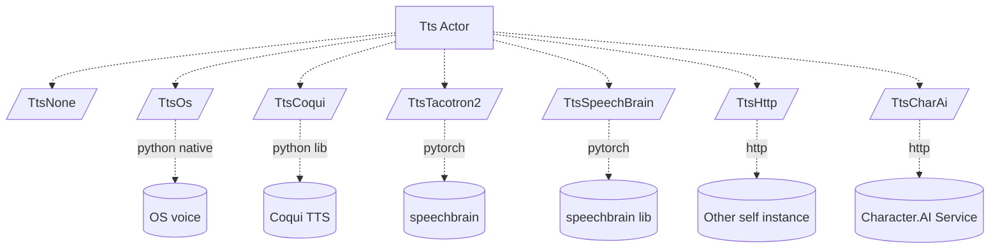
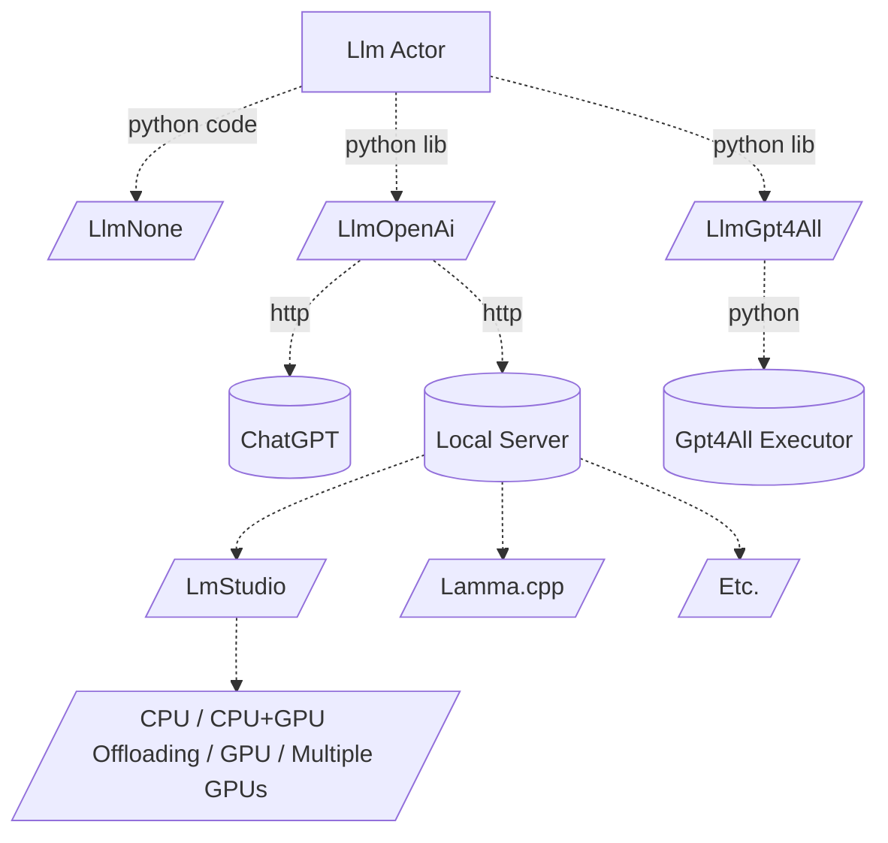
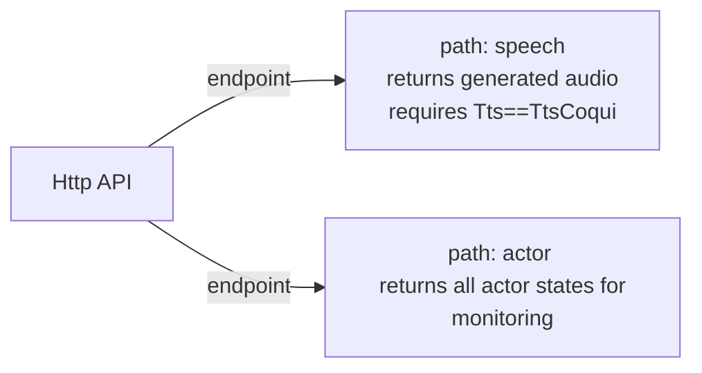

## Introduction
This is a voice assistant python program. Features:
- speech recognition
    - configurable tts engine (local offline)
    - configurable wake word
    - transcribes user speech
    - automatic microphone recovery
- speech feedback
    - configurable speech engine (possibly using offline)
- conversation with LLM
    - configurable llm engine (possibly using local OpenAI-compatible offline server)
- 3rd-party application integration
   - controllable through stdin through CLI or launched by external application
   - parsable output for convenient integration for 3rd-party applications
   - terminates automatically when parent terminates
- optimized for real-time use (instant chat/voice feedback)

## Architecture


###### Input


###### Output


###### Logic


###### Tts



###### LLM


###### Http


## Installation

1. Install python >= `3.11`
2. Install python dependencies
    ```
    pip install SpeechRecognition
    pip install playsound
    pip install sounddevice
    pip install soundfile
    pip install PyAudio
    pip install pysilero-vad
    pip install psutil
    pip install pyperclip
    pip install pyautogui
    pip install pygetwindow
    ```
3. Install desired tts module:
    1. **TtsOs** requires https://github.com/Akul-AI/rlvoice-1
        - `pip install rlvoice-1`
        - on Linux also needs `sudo apt update && sudo apt install espeak ffmpeg libespeak1`
        - on OsX also needs `pip install pyobjc==9.0.1`
    2. **TtsCoqui** requires https://pypi.org/project/TTS/
        - `pip install TTS`
        - Download XTTSv2 model
           - the following files into [models-coqui](models-coqui) directory
               - `config.json`
               - `hash.md5`
               - `model.pth`
               - `vocab.json`
           - agree to the terms and conditions in [models-coqui](models-coqui) directory by
               - creating `tos_agreed.txt` file with content `I have read, understood and agreed to the Terms and Conditions.`
    3. **TtsTacotron2**
        - TODO
    3. **TtsSpeecBrain** 
        - TODO
4. Install desired stt module:
    1. **SttWhisper** requires https://github.com/openai/whisper
        - `pip install openai-whisper`
        - model will be downloaded automatically, but you can do so manually
            - Download OpenAi Whisper [models](https://github.com/openai/whisper#available-models-and-languages) (optional)
            - into the [models-whisper](models-whisper) directory
            - from [official source](https://github.com/openai/whisper/blob/f296bcd3fac41525f1c5ab467062776f8e13e4d0/whisper/__init__.py)
    2. **SttNemo**
        - TODO
5. Install desired llm module:
    1. **LlmOpenAi**
    2. **LlmGpt4All**
        - `pip install gpt4all` 
        - Download LLM model for [GPT4All](https://gpt4all.io/index.html) (optional)
            - model is required only for conversation feature 
                - into the [models-llm](models-llm) directory
                - for example from [official source](https://gpt4all.io/models/models.json)

## Running

```python main.py```

For help invoke `-h` or `--help`

#### Recommended setup
First run the raw script with no arguments.
Setup microphone sensitivity settings and speech recognition model (`base.en` should be absolutely enough.
Or skip audio setup and control program though CLI `SAY`/`CHAT` commands.
Then try couple of commands.
For speech generation try offline `speech-engine=coqui`.
For llm chat try `llm-engine=openai` with [LmStudio](https://lmstudio.ai) and run it simply as server (everything should work out of the box).

#### Performance
Weak systems:
It should be possible to run Whisper (and os voice) and be able to do voice commands.

Good system:
Whisper small + Coqui + 8B (Q4) LLM model (CPU mode) work flawlessly on Nvidia 4070 + AMD 5800X3D.

##### Multitasking
Since voice generation is running simultaneously with chat LLM generation (and potentially whisper as well),
the requirements on hw (particularly gpu) may scale up fast. Experiment and see what works for you.
It may be better to run LLM purely on CPU to free GPU for text-to-speech and speech-to-text. 

#### Idle
To reduce GPU/CPU load, simply do not use any functionality.
It is possible to disable microphone and avoid speech-recognition.
It is currently not possible to unload any models from memory.

### Online/Offline
The goal of this project is to be offline and independent, but it is possible to use online llm and voice generation,
reducing hw requirements substantially.

## Integration

### Wake word
Can be configured with a script argument.
Experiment and pick word that you like, but is also easy to detect.

### Output format
This script prints:
- system log in format`SYS: $message`
- recognized user speech in format `RAW: $speech`
- recognized user speech, sanitized, in format `USER: $speech`
- recognized user command, in format `COM: $command`

All multiline content has newlines replaced by `\u2028`, an unicode newline character.
This allows `\n` newlines to define individual output boundaries, instead of defining custom special char/sequence.
Java does not recognize `\u2028` as newline, which can also be leveraged.

Output is streamed token by token. Consumer may want to read by token instead of lines.

### Input format (optional)
- `SAY-LINE: text` and speaks it (if `speech-engine` is not `none`)
- `SAY: $base64_encoded_text` and speaks it (if `speech-engine` is not `none`)
- `CHAT: $base64_encoded_text` and send it to chat (if `llm-engine` is not `none`)

Text for `SAY` and `CHAT` must be base64 encoded so it can contain multiline and special characters.
Base64 is more portable solution and guaranteed to solve all special character issues.
Currently, input is always consumed whole (no streaming).

### S2T (speech to text)

Currently, `OpenAI Whisper` or `Nvidia Nemo Parakeet` is supported. Model can be specified.

### T2S (text to speech)
By default, system voice is used.

#### none
No voice.

#### os
Uses built-in OS text-to-speech (offline, high performance, low quality).

#### coqui
Uses xttsv2 model (offline, low performance, realistic quality).
```
pip install torch
pip install TTS
```

#### character.ai
Supports [character.ai](https://beta.character.ai) voice generation (requires free account and access token)
using [PyCharacterAi](https://pypi.org/project/PyCharacterAI/), read details there.
```
pip install PyCharacterAI
```

### LLM (Chat)
By default, disabled. GPT4All supported models can be provided to enable LLM chat functionality.

### Termination
This script terminates:
- upon `CTRL+C`
- when parent process terminates, if launched with `parent-process=$pid` argument
- when receives `EXIT` on input stream

## Hardware requirements
Depends on the configuration.

## Copyright
See [LICENCE](LICENCE)

## Acknowledgment
Loosely based on **AI-Austin**'s [GPT4ALL-Voice-Assistant](https://github.com/Ai-Austin/GPT4ALL-Voice-Assistant)