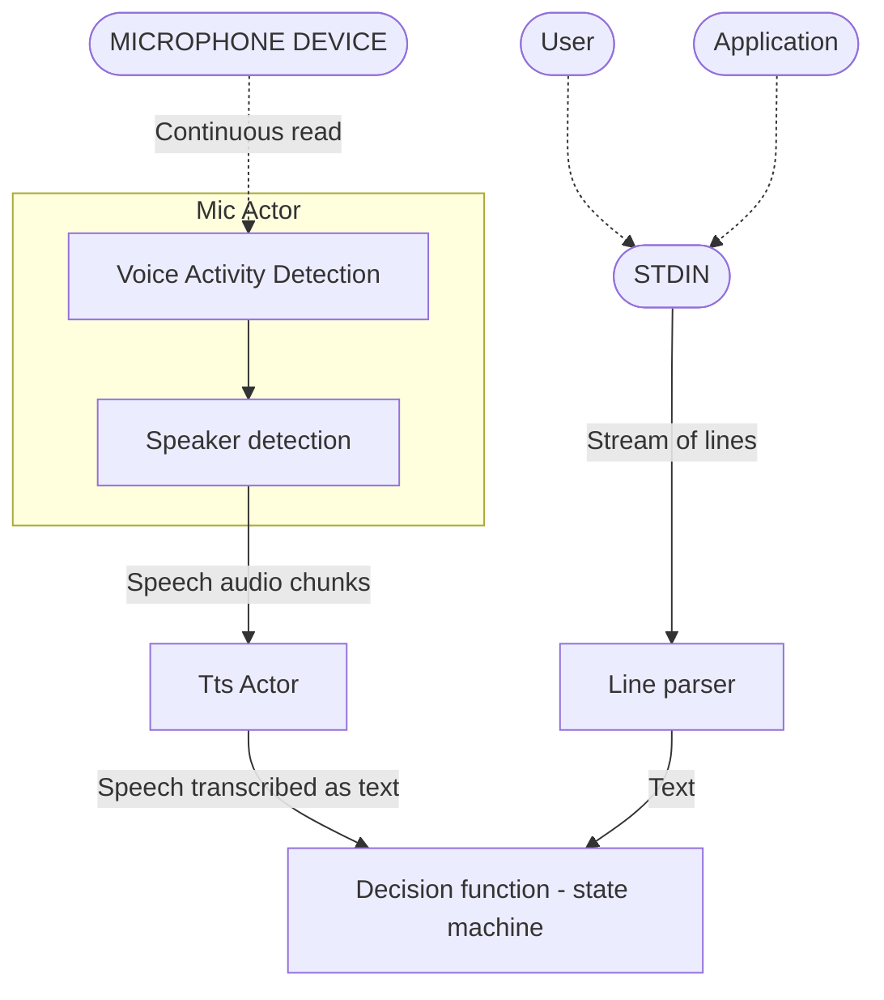
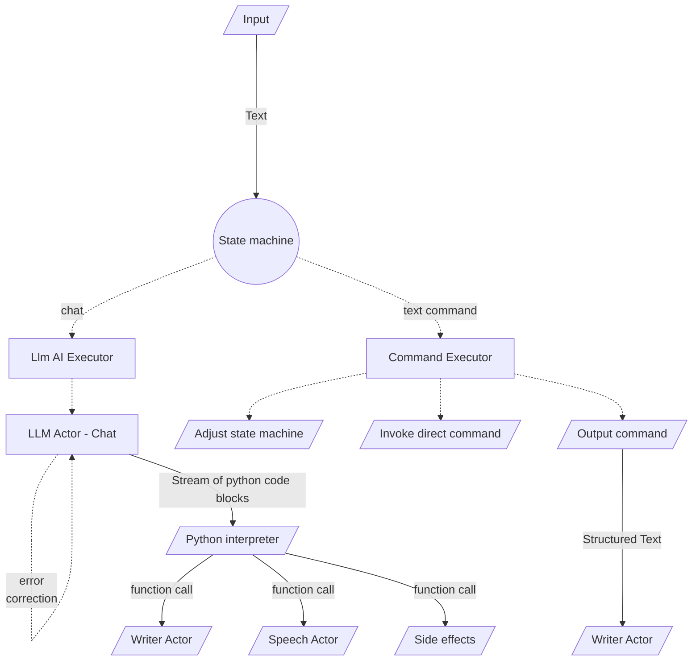
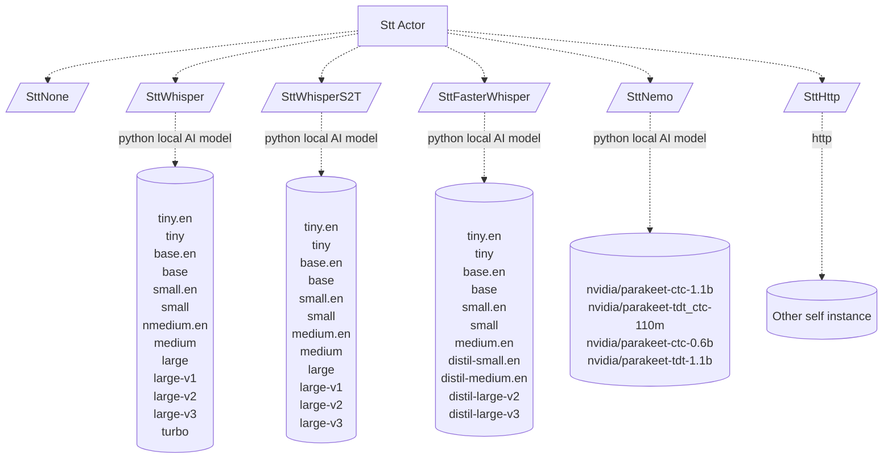
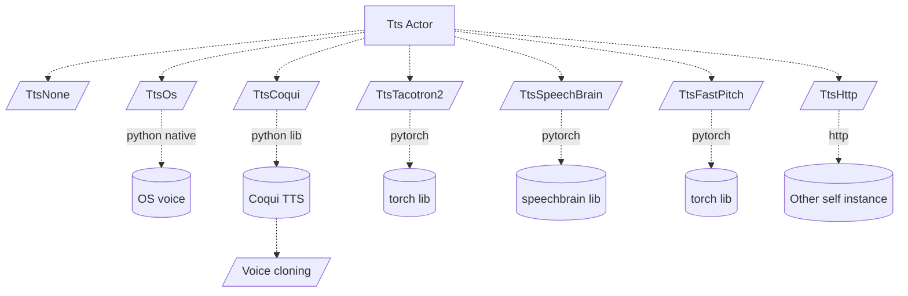
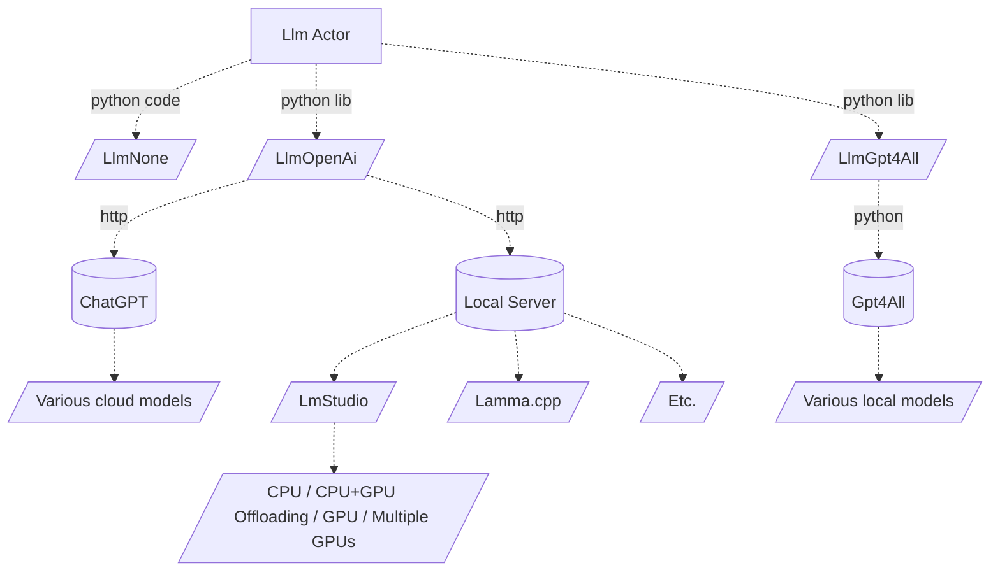
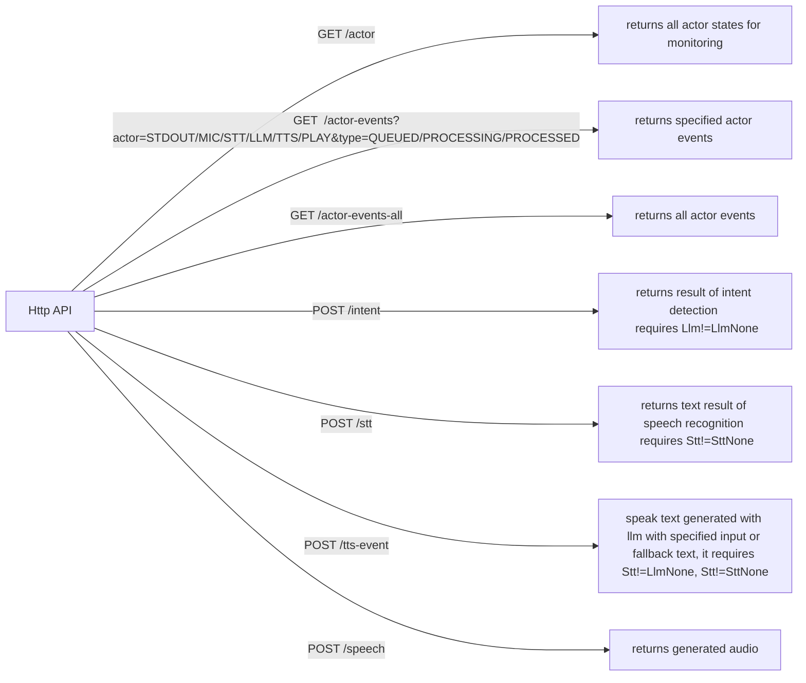

## Introduction
This is a voice assistant python program. Features:
- speech recognition
    - configurable tts engine (local offline)
    - configurable wake word
    - transcribes user speech
    - automatic microphone recovery
- speech feedback
    - configurable speech engine (possibly using offline)
- conversation with LLM
    - configurable llm engine (possibly using local OpenAI-compatible offline server)
- 3rd-party application integration
   - controllable through stdin through CLI or launched by external application
   - parsable output for convenient integration for 3rd-party applications
   - terminates automatically when parent terminates
- optimized for real-time use (instant chat/voice feedback)

## Architecture


###### Input


###### Output


###### Logic


###### Stt


###### Tts



###### Llm


###### Http


## Features

###### Voice control
User can speak to the assistant by speaking its name (configurable, `System` by default)
```
USR: System
SYS: yes
```
```
USR: System, command
SYS: doing command...
```

###### Assistant name
User can change assistant name to any text value.
However, the name should be easy for the system to recognize.
Further, name implying the function of the assistant may improve recognition of the following content, such as commands.
Hence, `System` turns out to be really good name, while custom names such as `Jarvis` less so.

###### Delayed voice control
User can avoid speaking assistant name during short period after the name was already spoken.
```
USR: System
SYS: Yes
USE: command without repeating system name
```

###### Voice chat
Use can speak without calling the assistant's name completely in chat mode.
In this mode user is conversing with LLM, which requires `LlmActor` enabled and running.
```
USR: System start covnersation
SYS: Conversing...
USR: Tell a joke
...
```

###### Voice dynamic responses
If LlmActor is enabled, user will try to avoid common hardcoded responses and
instead use Lllm to generate dynamic ones based on the (customizable) system prompt.
This can give the assistant more personality.

###### Voice detection
The assistant listens to microphone and obtains chunks of speech in real time.
Minimum volume treshold and VAD (voice activity detection) is being aplied to filter out non-speech.

###### Voice detection - speaker detection
The assistant can use speech diarization to detect whether speech is spoken by a verified voice.
User can add multiple verified vices, [see](./voices-verified/README.md).
This
- prevents assistant reacting to its own speech
- allows usage in noisy environment
- allows others using voice control

###### Voice commands
User may speak commands for assistent to execute.
These are matched against command's matcher (see features below).
```
USR: System my command
```
User may speak multiple commands at once, using `and` word.
```
USR: System my command and other command
```

###### Custom/Programmatic commands
Voice commands can be registered/unregistered programmatically at any time.
```kotlin
// create command
val handler = SpeakHandler("Name of the command", "command speech matcher") { text ->
   if (matches(text)) { doX(); Ok("Ok") }
   else null
}
// subscribe command
val unregister = Disposer()
val assistant = APP.plugins.plugin<VoiceAssistant>()
assistant.syncWhile { it.handlers addRem handler } on unregister  // subscribes handler while assistant is on and until custom disposer
unregister() // unsubscribe
```

###### Command matching
Command can be matched with arbitrary logic. There is built-in regex-like matcher that can be used.
This syntax supports:
- optional word using `word?`
- alternative word using `word1|word2|word3`
- parameters using `$param` (use `_` as delimiter)
Example of a matcher: `open|show widget? $widget_name widget?`
See `SpeakHandler` class.
```kotlin
SpeakHandler(name = "Log off OS", matcher = "log off system|pc|computer|os") {
   if (matches(text)) {
     logOff()
     Ok()
   } else
     null
}
```

###### Command feedback
Upon matching command, it returns `Try<String?, String?>?`, meaning success/error/no match with optional speech feedback.
This can be arbitrary complex, for example matching command but refusing match because of invalid parameter value:
```kotlin
SpeakHandler(name = "Say hello", matcher = "say hello"
) {
  if (matches(text))
    if (feelLikIt()) Ok("Hello")
    else Error("No thank you")
  else
    null // no match
}
```

###### Asynchronous commands
The commands are Kotlin suspending functions and as such implicitly support asynchronous execution.
Inside the handler, it is possible to launch Kotlin coroutines, wait for jobs or futures, delay, and so on.

###### Command parameters
It is up to the command logic to extract the parameters from the command, but the built in
matcher is transformed into regex and can be used to extract the values using `Regex` API.
TO make this easier, there is `args(text)` method, that does this, and with destructuring support
```kotlin
SpeakHandler(...) {
   if (matches(text)) {
      // using regex API
      val args = regex.matchEntire(text)!!.groupValues  // regex implicitly available, matching guaranteed to pass here
      // manually
      val arg1 = text.substringAfter("command-prefix") // arbitrary logic
      // auto
      val (arg1, arg2) = args(text) // destructures to tuple of any size!
      
      if (validateMyInput(arg1)==false) return null // return no match for bad parameter
     ...
   } else
     null
}
```

###### Command intent detection
Sometimes the parameter value should be more flexible than simply used as spoken by user.
User may not remember exact parameter values or even exact command. 
If no command matches, and LLM Actor is running, the command is passed to LLM for intent-detection.

In this phase, LLM takes a prompt with available commands and user speech and creates command by itself.
If LLM assumes no command matches what user intended, it returns no-op command.
The prompt with available commands needs not be structured and may have smart hints for the LLM,
such as comment explaining the command parameters or giving range of possible values).
```
Available functions:
- open-widget-$widget_name  // available widgets: weather, playlist, ...
- ignored // when no command is probable
```

This way, saying `whats the weather like` may produce actual command `open-widget-weather-info`.
This makes voice control much more flexible.
This is automatic and requires no code or setup other than `Llm` actor enabled and good model
(`mistral instruct v0.2 7B` or `Nous Hermes 2 Mistral DPO 7B` do a great job)

###### Command parameter intent detection
Sometimes the command or parameter is dynamic or the command hint for the LLM is too long or troublesome.
Command may, after successful match, even after intent detection, use LLM to detect correct parameter value.
For this `SpeakContext.intent` function may be used, which invokes customized intent detection.
One may wish to simply pass the result of the `intent` function back into itself, which is possible and prevents infinite loop automatically.
```kotlin
fun SpeakContext.openWidget(text: String): ComMatch =
   if (matches(text)) {
      val widgetName = ...
      if (f!=null) openWidget(widgetName)
      // widget found
      if (f!=null) Ok("Ok")
      // widget not found and we already tried custom intent (propagated automatically with `SpeakContext` as `this.intent`)  
      else if (!intent) Error("No widget $fNameRaw available.")
      // widget not found, try custom intent that calls self
      else intent(text, "${availableWidgets()}\n- unidentified // no recognized function", fNameRaw) { this("open widget $it") }
   } else {
      if (!intent) Error("No such widget available.")
      else null
   }
SpeakHandler("Open widget by name", "open|show widget? \$widget-name widget?") { openWidget(it) }
```

###### Command confirmation
Sometimes a command should require a confirmation or ask user for additional arguments before being invoked.
For this, command may put itself into a confirmation queue using `SpeakContext.confirming` function,
which invokes the actual behavior with the additional user voice feedback.
The confirmation queue is `first-in-last-out` and (last) command is cleared on first user voice response, regardless of matching result.
The confirmation request and confirmation matcher are both flexible.
Example of such command:
```kotlin
SpeakHandler(name = "Log off OS", matcher = "log off system|pc|computer|os") {
   if (matches(text)) confirming("Do you really wish to turn off pc?", "yes|indeed|roger") { turnOffPc() }
   else null
}
```

###### Command chaining
The `SpeakContext.confirming` and `SpeakContext.intent` functions can be mixed and nested to do hierarchical command matching.
This allows reducing the size of command hint prompt to LLM and reducing chance
that LLM will confuse multiple similar commands by using multiple guided inferences instead of one complicated one.
Developer has power to guide the matching process freely and provide dynamic context to guide LLM.

If these multiple inferences should be part of user interaction, use `confirming`, if they need be hidden, use `intnt()`.
```kotlin
SpeakHandler(name = "Configure", matcher = "configure system") {
   if (matches(text))
     confirming("Which settings?", "\$setting") { setting ->
       if (isUnknownSettng(setting) 
         Error("Unknown setting $setting")
       else confirming("What value? Possible values are: ${listSettings()}", "\$value}") { value ->
         if (isUnknownValue(setting) Error("Unknown setting value $value")
         else changeSetting(setting, value)
       }
     }
   else
    null
}
```

###### General intent detection
The `SpeakContext.intent` uses `\intent` http API of the underlying python process.
The `\intent` http API is not limited and can be used by any application and in any way.
It is simply a service to intelligently convert input into output.

## Installation

1. Install python >= `3.11`
2. Install python dependencies
    ```
    pip3 install sounddevice
    pip3 install soundfile
    pip3 install pysilero-vad
    pip3 install psutil
    pip3 install pyperclip
    pip3 install pyautogui
    pip3 install pygetwindow
    pip3 install stream2sentence
    pip3 install torch
    pip3 install torchaudio
    pip3 install scipy
    pip3 install librosa
    ```
   - Windows specific
    ```
    pip3 install pycaw
    ```
3. Install desired tts module:
    1. **TtsOs** requires https://github.com/Akul-AI/rlvoice-1
        - `pip install rlvoice-1`
        - on Linux also needs `sudo apt update && sudo apt install espeak ffmpeg libespeak1`
        - on OsX also needs `pip install pyobjc==9.0.1`
    2. **TtsCoqui** requires https://github.com/idiap/coqui-ai-TTS
        - `pip install coqui-tts==0.24.1`
        - Download XTTSv2 model
           - the following files into [models-coqui](models-coqui) directory
               - `config.json`
               - `hash.md5`
               - `model.pth`
               - `vocab.json`
           - agree to the terms and conditions in [models-coqui](models-coqui) directory by
               - creating `tos_agreed.txt` file with content `I have read, understood and agreed to the Terms and Conditions.`
    3. **TtsTacotron2**
        - TODO
    4. **TtsSpeecBrain** 
        - TODO
    5. **TtsFastpitch** 
        - TODO
4. Install desired stt [module](#tts-text-to-speech):
5. Install desired llm module:
    1. **LlmOpenAi** requires https://github.com/openai/openai-python
        - `pip install openai==1.28.0` 
    2. **LlmGpt4All** requires https://github.com/nomic-ai/gpt4all/releases/tag/v2.7.5
        - `pip install gpt4all==2.6.0` 
        - Download LLM model for [GPT4All](https://gpt4all.io/index.html) (optional)
            - model is required only for conversation feature 
                - into the [models-gpt4all](models-gpt4all) directory
                - for example from [official source](https://gpt4all.io/models/models.json)

## Running

```python main.py```

For help invoke `-h` or `--help`

#### First run & recommended setup
First run the raw script with no arguments (it has sensible defaults).
Setup microphone sensitivity through UI or using micrphone verbose settings.
Control program though [CLI](#input-format-optional).

Try speech recognition model (`base.en` should be absolutely enough.
For speech generation try offline `speech-engine=coqui`.

For llm chat try `llm-engine=openai` with [LmStudio](https://lmstudio.ai) and run it simply as server (everything should work out of the box).
Use `Meta-Llama-3.1-8B-Instruct` model.

#### Specialized setup
It is possible to run only particular features, using `SttNone, LlmNone, TtsNone, mic-enabled=false`. For example:
- Only stt: `python main.py  llm-engine=none speech-engine=none stt-engine=whisper stt-whisper-model=tiny.en`

#### Network setup
It is possible to offload or provide AI computation on different machine, using another instance of this application,
and connecting to it using `SttHttp`, `LlmOpenAi`, `TtsHttp`.
It is up to the user to choose proper setup and infrastructure.
This makes it possible to run parts of the application on different platforms, different systems,
separate client and server, offload entirety of computation needed for inference elsewhere, and so on.

#### Performance
The main components using resources are Tts, Stt and Llm.
If any of these componnets is disabled or offloaded through http, you can allocate hw to the remaining components, e.g., by using better AI models.
Below is recommended setup for given hardware assuming all three components are active.

**Weak systems (no GPU)**:   
`SttFasterWhisper(tiny.en.pt) + TtsOs + Llm(8B_Q4_CPU)`   
Alternatively, offload the computation to another instance on other pc over http with `SttHttp` + `TtsHttp` + `LlmOpenAi`.

**Good system (12GB VRAM)**:   
`SttFasterWhisper(distill-small.en.pt) + TtsFastPitch + Llm(8B_Q4_CPU)`   
Distill whisper is small and fast. FastPitch is also very fast.
LLM model (CPU mode) work well on `Nvidia 4070` + `AMD 5800X3D`.

**Powerful system (24GB VRAM)**:   
`SttNemo(parakeet-ctc-0.6b) + TtsFastPitch + Llm(8B_Q8_GPU)`
Nemo has better speech recognition than Whisper and is faster and here not memory bound. Use bigger llm model and gpu offloading.

**Very powerful system (>36GB VRAM)**:   
`SttNemo(parakeet-tdt-1.1b) + TtsFastPitch|TtsCoqui + Llm(>8B_Q8_GPU)`
Use best nemo model. Try higher llm quants. Try offloading speaker diarization AI to GPU as well.

##### Multitasking
Since we have potentially multiple AIs running at once (stt, llm, tts, vad, etc.),
the requirements on hw (particularly gpu) scale up fast. Experiment and see what works for you.
It may be better to run LLM purely on CPU to free GPU for text-to-speech and speech-to-text. 

##### Memory bottlenecks
RAM and VRAM size limit the size of the models that can be used.
Using lower quants (Q8, Q4 and so on) helps, but output quality degrades.
Q8 model is twice smaller and twice faster than Q16 (normal size). Q4 quality drop is already noticeable.

Memory bandwidth is a limiting factor for inference (AI speed).
Tts may be sensitive to GPU bandwidth being overwhelmed. Consider using multiple GPUs.

Llm model will also use a lot of memory for context buffer. So set context size to your needs. [See](#context-size).

##### Multiple GPUs
Multiple GPUs is easiest way to scale VRAM as well as memory bandwidth.
Consider running Stt, Llm, TTs components on different GPUs (through settings).
Llm models can be oftentimes transparently loaded across multiple GPUs as well (without NvLink).
So, running `RTX4070 + RTX3090` or other such GPU combo is recommended and easy to use way to run this assistant. 


#### Idle
To reduce GPU/CPU load, simply do not use any functionality.
It is possible to disable microphone and avoid speech-recognition.
It is currently not possible to unload any models from memory.

#### Online/Offline
The goal of this project is to be offline, private, independent and anonymous, but some parts (LlmOpenAi) can use
online services. Consult the diagrams.

#### Troubleshooting
The assistant architecture is based around actors and these publish their state over http.
Use http or desktop UI widget's `HW` and `Events` tabs to see state of the system and timeline of all events.

## Privacy
The application is designed to be private and local.

It supports distributed multi-instance architecture over http.
The communication between multiple instances of this application is unsecured and plainly readable.
You may therefore need to block/unblock the application though firewall, depending on the features used.

For privacy, stay offline, in local network or inside VPN.

The application:
- does not expose http API to the internet, unless user explicitly changes `localhost` to `0.0.0.0`.
- does not connect to **any** online services or  log in anywhere
- may download AI models first time enabled features require them

The only http communication is for:
- downloading models
- http api for UI integration
- stt/tts/llm communication if computing is offloaded to another instance/server

## Integration

### Wake word
Can be configured with a script argument.
Experiment and pick word/s that you like, but use words that are easy to detect with the Stt.

### Output format
This script prints:
- system log in format`SYS: $message`
- recognized user speech in format `RAW: $speech`
- recognized user speech, sanitized, in format `USER: $speech`
- recognized user command, in format `COM: $SPEAKER:$LOCATION:$command`

All multiline content has newlines replaced by `\u2028`, an unicode newline character.
This allows `\n` newlines to define individual output boundaries, instead of defining custom special char/sequence.
Java does not recognize `\u2028` as newline, which can also be leveraged.

Output is streamed token by token. Consumer may want to read by token instead of lines.

### Input format (optional)
- `SAY-LINE: text` and speaks it (if `speech-engine` is not `none`)
- `SAY: $base64_encoded_text` and speaks it (if `speech-engine` is not `none`)
- `CHAT: $base64_encoded_text` and send it to chat (if `llm-engine` is not `none`)

Text for `SAY` and `CHAT` must be base64 encoded so it can contain multiline and special characters.
Base64 is more portable solution and guaranteed to solve all special character issues.
Currently, input is always consumed whole (no streaming).

### Mic

#### Sensitivity
It is important to set microphone sensitivity to the right value.
Even though after treshold detection, voice activity detection and optionally speaker fingerprint detection is ran:
    - If the value is higher than your captured voice energy, speehc will not be detected
    - If the value is lower than ambient noise, volume treshold filtering speech detection is effectively disabled:
        - vad (voice activity detection) will run effectively all the time, causing higher CPU load and possible speech generation or even system stutter
        - external noise or speech may be triggered to be speech, if it passes through vad and speaker diarization
        - speech detection may never end as it requires speech pauses and vad

For this the python application has `mic-verbose` flag that prints real-time microphone energy. 
The assistant ui widget shows real-time energy in microphone settings ui.

#### Noise-cancelling
Some `TTS` models like `OpenAi Whisper` hallucinate which can cause assistant to react to non-existent input.
It is recommended to use [SttNemo](#sttnemo) model that does not have this problem.
Alternatively, avoid noise that can get to tts stage (through voice activity detection and speaker detection).
For this, you can use noise cancelling and/or echo cancelling feature.
It is recommended to use microphone with noise cancelling built-in, as it simplifies the setup and reduces compute load on the system.
Alternatively, use application such as [Nvidia Broadcast](https://www.nvidia.com/en-eu/geforce/broadcasting/broadcast-app/).

#### Multiple microphones
The assistant supports multiple microphone inputs.
Each can be assigned different location.
Microphone location is passed as speaker location to `Llm` as context.

### Stt (speech to text)

Currently, `OpenAI Whisper` or `Nvidia Nemo Parakeet` is supported. Model can be specified.
Model leaderboard: https://huggingface.co/spaces/hf-audio/open_asr_leaderboard
TLDR is - if you have Nvidia GPU and enough VRAM, always run `Nvidia Nemo` over `Whisper`.

#### SttWhisper
Install
- requires https://github.com/openai/whisper
- `pip install openai-whisper==20231117`
- model will be downloaded automatically, but you can do so manually
- Download OpenAi Whisper [models](https://github.com/openai/whisper#available-models-and-languages) (optional)
- into the [models-whisper](models-whisper) directory
- from [official source](https://github.com/openai/whisper/blob/f296bcd3fac41525f1c5ab467062776f8e13e4d0/whisper/__init__.py)

#### SttWhisperS2T
Install
- requires https://github.com/shashikg/WhisperS2T (`CTranslate2` backend)
- `pip install whisper-s2t`
- model will be downloaded automatically

#### SttFasterWhisper requires https://github.com/SYSTRAN/faster-whisper
Install
- `pip install faster-whisper`
- model will be downloaded automatically

#### SttNemo
Install
- `pip install nemo_toolkit[asr]`

Nemo is of higher quality while being faster than even the best whisper-large model.
In addition, it has no hallucinations for non-speech input.
Hardware requirements are Nvidia GPU.

#### SttHttp
TODO

### Tts (text to speech)
By default, `TtsOs` is used.

#### TtsNone
No voice.

#### TtsOs
Uses built-in OS text-to-speech (offline, high performance, low quality).
Sounds robotic and has high delay, but is accessible on any system and has low hardware requirements.

#### TtsCoqui
Uses xttsv2 model (offline, low performance, realistic quality).
It supports voice cloning and real-time streaming.
However it is slower, has problems speaking numbers and short sentences, and sometimes hallucinates. 

```
pip install torch
pip install TTS
```

Guide to create/clone/configure voices is in [voices-coqui/REaDME.md](voices-coqui/README.md)

#### TtsFastPitch
Fastpitch is the fastest and most quality tts available here.
It has minimum hallucinations and handles speaking numbers very well.
It does not support voice cloning.

### LLM (Chat)
By default, disabled.

### Choosing model
Recommended and well tested models are `Meta-Llama-3.1-8B-Instruct` or `Mistral Nemo Instruct 2407`.
`Phi` or `Gemma` models work too.
Cloud models like `GPT` or `Claude` should have no problem either (but remain untested as privacy is lost).

### Finetunes
Some models have lot of finetunes available.
Sometimes the quality drop is not worth it, other times it may be even better.
There may be unexpected behavior or quirks in assistant responses caused by the finetuned model.
Sometimes, this can be fixed by adding specific system prompt instructions, but this may be error-prone, not portable and fragile.
Try out various models and prompts.

### Censorsip & refusals
This assistent has no limitations and let's user specify his own assistant personas and prompts.
Some models are censored or have high rate of refusals and moralizing.
For reducing refusals, look for `abliterated` version of the model, such as `Meta-Llama-3.1-8B-Instruct-abliterated`
For NSFW, try `Llama-3SOME` or something similar.

#### Instruct vs Base
Use `Instruct` models (intended for conversation).
`Base` models are not supported for now.

#### Context size
Llm context size is a limiting factor for interacting with Llm.
This assistant uses about 4000 tokens for its prompt, which means standard model with 8000 context size is fine for normal use.

To preserve context size, it is possible to restart the conversation with the assistant.
The conversation is restarted automatically after certain idle time period.

Newer Llm models now support well up to 100k context size.
Unfortunately the buffer is fixed, which means the memory allocation rises with the context size set, not used.
To preserve memory, it is recommended to use set smaller context size when deploying the Llm model.

### Conversation

#### Context
Each user message to llm has a context:
- TIME - current date and time
- SPEAKER - person sending the message, detected from 'verified voices' and spoken voice or by default 'User'
- LOCATION - location of the SPEAKER, user can assign locations to microphone 

### Termination
This script terminates:
- upon `CTRL+C`
- when parent process terminates, if launched with `parent-process=$pid` argument
- when receives `EXIT` on input stream

## Hardware requirements
Depends on the configuration.

## Copyright
See [LICENCE](LICENCE)

## Acknowledgment
Loosely based on **AI-Austin**'s [GPT4ALL-Voice-Assistant](https://github.com/Ai-Austin/GPT4ALL-Voice-Assistant)